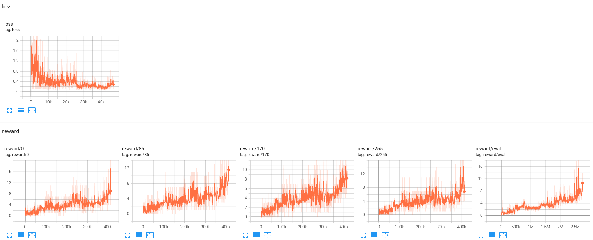

# SEED RL + Ape-X + Retrace + Meta Controller

## 紹介

SEED RLでのApe-Xをベースとして、Agent57のRetraceとMeta ControllerをPytorchで実装しています。

* [Distributed Prioritized Experience Replay](https://openreview.net/pdf?id=H1Dy---0Z)(Ape-X)
* [SEED RL: Scalable and Efficient Deep-RL with Accelerated Central Inference](https://openreview.net/pdf?id=rkgvXlrKwH)
* [Agent57: Outperforming the Atari Human Benchmark](https://arxiv.org/pdf/2003.13350)

## 準備

```
pip install -r requirements.txt
```

## 実行

```
python main.py
```

## 結果

### 実行環境

Python 3.10 / Ryzen 5950x / RTX A4000 / Atari Game "Breakout"

### ステップ数

 

### 実行時間

 
